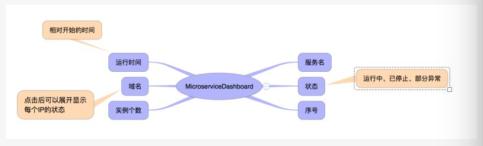

# microservice－dashboard 
 **microservice－dashboard**是基于Vue.js 2.x系列 + bootstrap的后台管理系
 统，其框架可以参考[线上地址](https://github.com/lin-xin/manage-system)

## 功能

## 目录结构介绍 ##

	|-- build                            // webpack配置文件
	|-- config                           // 项目打包路径
	|-- dist                             // 生产环境文件
	|-- src                              // 源码目录
	|   |-- components                   // 组件
	|       |-- common                   // 公共组件
	|           |-- Header.vue           // 公共头部
	|           |-- Home.vue           	 // 公共路由入口
	|           |-- Sidebar.vue          // 公共左边栏
	|		|-- page                   	      // 主要路由页面
	|           |-- microService.vue     // 微服务
	|           |-- Login.vue          	 // 登录
	|   |-- App.vue                      // 页面入口文件
	|   |-- main.js                      // 程序入口文件，加载各种公共组件
	|-- .babelrc                         // ES6语法编译配置
	|-- .editorconfig                    // 代码编写规格
	|-- .gitignore                       // 忽略的文件
	|-- index.html                       // 入口html文件
	|-- package.json                     // 项目及工具的依赖配置文件
	|-- README.md                        // 说明

## 安装步骤
git clone https://github.com/lin-xin/manage-system.git  // 把模板下载到本地

修改下载下来的模版的文件名称为microservice－dashboard

cd microservice－dashboard  // 进入模板目录

修改package.json配置(增加bootstrap、jquery)

修改build文件下面webpack.base.conf.js，增加jquery模版如下：

	rules: [
      {
        test: require.resolve('jquery'), 
        loader: 'expose-loader?$!expose-loader?jQuery'
      },

npm i --registry=https://registry.npm.taobao.org  // 安装项目依赖，等待安装完成之后

## 本地开发
npm run dev   // 开启服务器，浏览器访问 http://localhost:8080
	
## 构建生产
npm run build // 执行构建命令，生成的dist文件夹放在服务器下即可访问

## 组件/功能实现
### bootsrap

> 字体图标

> 模态框

> 表格 

详见[bootstrap中文文档](http://v3.bootcss.com/)

### 获取数据

> 通过ajax请求加载服务端数据

### 表格分页

> 首先在data数据中定义总页码、页码等，如下：

	len : 10,                 // 每页显示个数
    lens : [10, 20, 30],     // 显示个数数组
    pageTotal : '',            // 总页数
    pages : [],              // 页码
    activeNum : 0,           // 页码数组下标
	
> 然后通过vue计算属性 computed 计算当前页的首行（start）和末行（end）序号
> 
> 再通过 onChangeLen() 方法，在改变每页显示个数（len）时候同步改变总页数，并初始化activeNum和start

### 搜索功能

>每次输入需要检索的字时都会判断一下源数据表格sourceList中符合要求的数据并组合成新的数据表格List，方法如下：

	onSearch() {
        this.List = this.sourceList.filter(item => {
          return ~JSON.stringify(item).toUpperCase().indexOf(this.keywords.toUpperCase());
        });
        this.pageTotal = Math.ceil(this.List.length / this.len);
      },

### 计时功能
主要需要考虑两点：
<ol>
	<li>当打开页面时实时计时当前时间</li>
	<li>当关闭离开页面时及时关闭计时功能</li>
</ol>
代码如下：
    
    created: function(){
      this.getData();
      this.interval = setInterval(()=>{
        this.timeNow = new Date().getTime();
      }, 1000)
    },
    beforeDestroy: function(){
      this.interval && clearInterval(this.interval)
    },

下面是计算时间差的方法：

	formatTime(time) {
        if(!time || Number.isNaN(time)) {
          return '';
        }
        var days=Math.floor(time/(24*3600*1000));
        var leave1=time%(24*3600*1000);
        var hours=Math.floor(leave1/(3600*1000));
        var leave2=leave1%(3600*1000);        //计算小时数后剩余的毫秒数
        var minutes=Math.floor(leave2/(60*1000)) ;
        var leave3=leave2%(60*1000);      //计算分钟数后剩余的毫秒数
        var seconds=Math.round(leave3/1000);
        return days+"天 "+hours+"小时 "+minutes+"分钟 "+seconds+"秒 ";
      },    

## 其它注意事项
*  在使用vue搭建框架之前，最好学习了解es6 
*  npm un 组件名称 -S  //卸载组件，比如需要卸载vue-datasource，可以这样写：npm un vue-datasource -S
  
