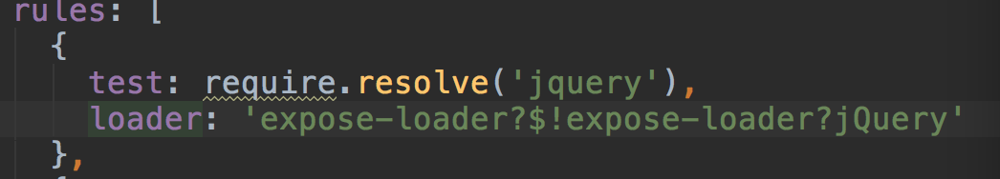

# microservice－dashboard 
 **microservice－dashboard**是基于Vue.js 2.x系列 + bootstrap的后台管理系统，其框架可以参考[线上地址](https://github.com/lin-xin/manage-system)

## 功能
-  bootstrap
-  登录/注销
-  表格

## 安装步骤
git clone https://github.com/lin-xin/manage-system.git  // 把模板下载到本地

修改下载下来的模版的文件名称为microservice－dashboard

cd microservice－dashboard  // 进入模板目录

修改package.json配置(增加bootstrap、jquery)

修改build文件下面webpack.base.conf.js，增加jquery模版如下：

npm i --registry=https://registry.npm.taobao.org  // 安装项目依赖，等待安装完成之后

## 本地开发
npm run dev   // 开启服务器，浏览器访问 http://localhost:8080
	
## 构建生产
npm run build // 执行构建命令，生成的dist文件夹放在服务器下即可访问